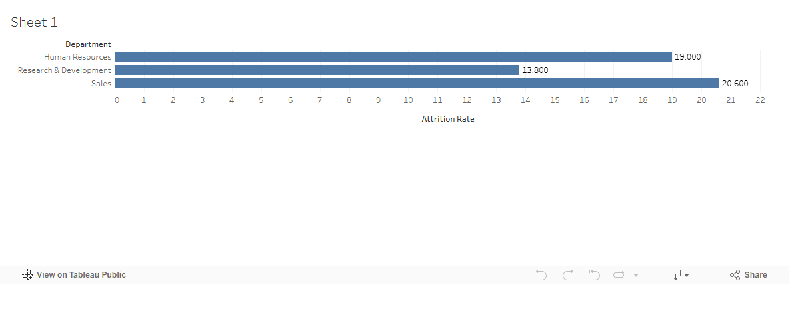

# Workforce Attrition Analytics

Diagnostic, predictive, and prescriptive analysis of employee attrition, packaged the way a consulting team would hand it to an HR director.

**Status:** In progress. Phase 1 of 6.

## Problem

Voluntary attrition is one of the most expensive line items a mid-size company carries, and most HR teams can name the symptoms without naming the drivers. This project takes a public HR dataset (IBM, n=1,470) and answers three questions an HR director actually asks:

1. Who is leaving, and which groups are leaving fastest?
2. What predicts whether a given employee will leave in the next year?
3. Where should the next dollar of retention spend go?

## Headline Finding

*Pending Phase 5. Will be lifted from the executive memo once the modeling is complete.*

## Live Dashboard

*Pending Phase 4. Tableau Public link will go here.*



## Repo Structure

```
workforce-attrition-analytics/
├── data/                      # IBM HR dataset (raw)
├── 01-eda.Rmd                 # Phase 1: exploratory analysis (R)
├── 02-hypothesis-tests.Rmd    # Phase 2: chi-sq, t-tests, effect sizes (R)
├── 03-model-R.Rmd             # Phase 3a: logistic regression (R)
├── 04-model-python.ipynb      # Phase 3b: XGBoost + SHAP (Python)
├── 05-model-comparison.md     # Phase 3c: honest model tradeoff writeup
├── memo.md / memo.pdf         # Phase 5: 2-page executive memo
├── outputs/
│   ├── attrition-risk-scores.csv
│   ├── tableau-preview.png
│   ├── resume-bullets.md
│   └── interview-script.md
└── README.md
```

## Methodology

- **EDA and hypothesis testing** in R (tidyverse, ggplot2, patchwork, corrplot, effsize). Chi-squared tests for categorical drivers, Welch's t-tests for numeric drivers, Bonferroni correction across the full battery, Cohen's d for effect sizes.
- **Predictive modeling** in two stacks for an honest comparison. Logistic regression in R for interpretable odds ratios and confidence intervals. XGBoost in Python for predictive lift, with SHAP for per-feature attribution.
- **Evaluation** on a held-out 20% test set: AUC, confusion matrix at threshold 0.5, Brier score, top-decile lift.
- **Dashboarding** in Tableau Public: overview KPIs, driver explorer, and an at-risk employee table fed by the XGBoost probabilities.

## How to Reproduce

1. Clone the repo.
2. Download the IBM HR Analytics Employee Attrition dataset from Kaggle into `data/`.
3. Knit the .Rmd files in numeric order. Run the Python notebook with the requirements in `requirements.txt`.
4. Open the Tableau workbook and point the at-risk view at `outputs/attrition-risk-scores.csv`.

## Limitations

- The IBM HR dataset is synthetic and widely studied. Findings illustrate method, not industry truth.
- n=1,470 is small. Several relationships will reach statistical significance with trivial effect sizes; the analysis flags these explicitly rather than over-claiming.
- Replacement cost is modeled as a flat $15K per leaver, exposed as a parameter in the dashboard. Real costs vary widely by role.

## Author

Zohair Khan. Industrial Engineering, Texas A&M, May 2027.
